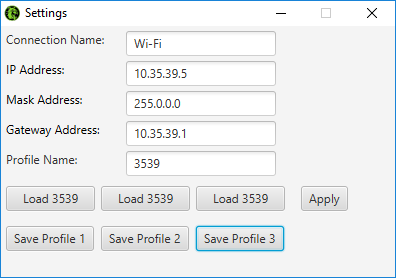
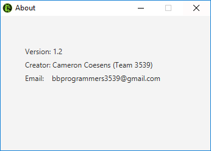

# FRC-IP-Switch
This is a program meant for FRC teams that use static IPV4 address for robot communication. It allows a team to quickly switch to (or from) DHCP(dynamic) for internet use from (or to) static for robot use. 

  

The home screen allows you to quickly switch back and forth between static and dhcp

  

The settings screen allows you to change what your static ip is going to be when you press the static button on the home screen. Aswell as to create profiles so you can change between static ips quickly.

  

The about screens allows you to tell what version of the program you are running and see who made it or if you need to contact us in some way.

