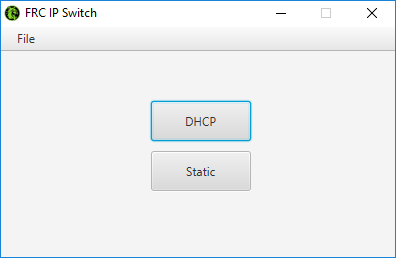

# FRC-IP-Switch
This is a program meant for FRC teams that use static IPV4 address for robot communication. It allows a team to quickly switch to (or from) DHCP(dynamic) for internet use from (or to) static for robot use. 

  

